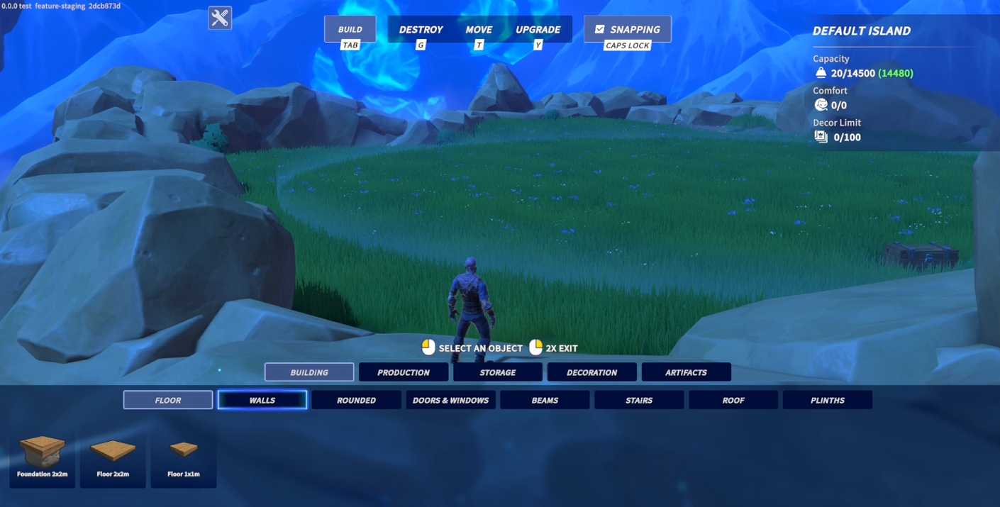
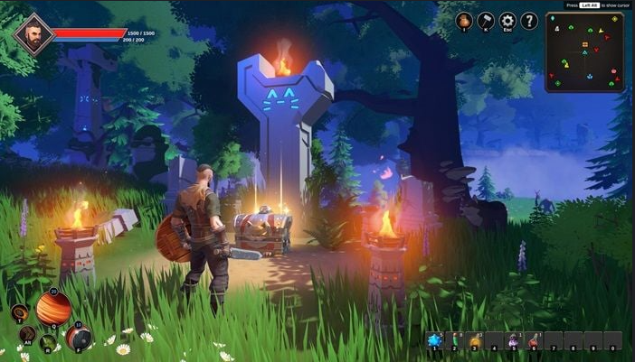

# 🎮 Portfolio — Konstantin Galaev

## 1. WorldShards Construction Mode
A flexible construction system for placing modular objects in 3D environment.

Key features:

- Custom building and construction mode for a 3D adventure game, based on the EasyBuild package with extensive rework and the addition of new mechanics

- Over 300 building elements and decorative objects, offering extensive creative freedom

- Convenient placement, movement, destruction, and upgrading of construction elements

- Flexible placement rules and conditions — easily define custom rules, such as allowing paintings only on walls or other vertical surfaces, and carpets only on floors

- Structural integrity control — supporting elements cannot be removed if this would result in other objects being left suspended in mid-air

## 2. Interactive Puzzles & Props
Collection of interactive objects and logic puzzles for adventure maps.
 

- Video: [View on Google Drive](https://drive.google.com/file/d/10bNhZQxC3nMW5a3WrnIlYyWvgOiUQRf8/view?usp=sharing)
- Example of a technical specification for programmers for the final version of a puzzle mechanic (https://docs.google.com/document/d/1QC5IL1CiAI1ZYtQUN-0JckxW1egm7xtRtRibfJPa3SU/edit?usp=sharing)

- 18 types of customizable logic and arcade puzzles for a 3D adventure game

- Adjustable difficulty settings for most puzzles

- Randomized initial state when the player re-enters a scene

- Interactive objects and mechanics for adventure locations — destructible objects, moving platforms, and interactive elements with animations and visual effects

---

## 3. Custom Editor Tools (Unity)
Custom Unity Editor extensions for faster workflow: level setup tools, spline utilities, etc.

**Media:**  
- Repository: [Unity Editor Tools Demos](https://github.com/Konstantin-Galaev/unity-editor-tools-demos)
